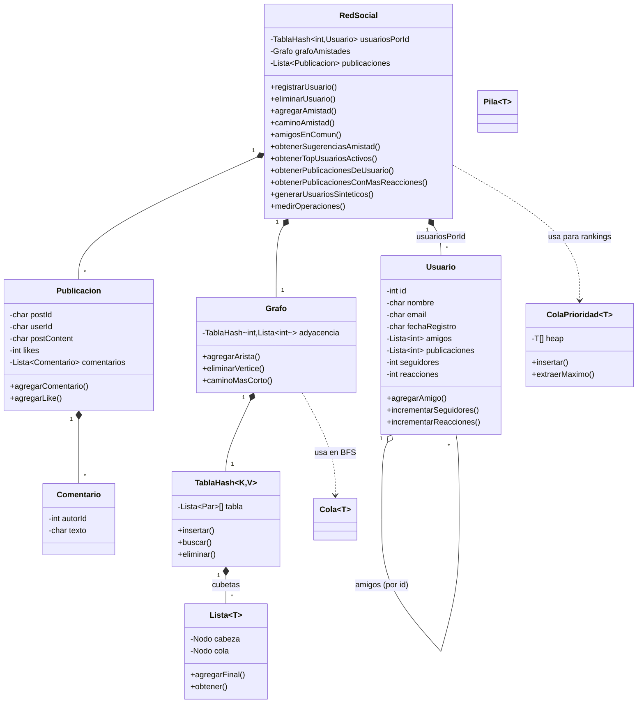

# Informe técnico — Red social con estructuras de datos propias

Proyecto Final, curso de Algoritmos y Estructuras de Datos (AED). Escrito según el reparto
de `PLAN-v2.pdf` y verificado contra el código real en cada sección — cada afirmación
técnica de este informe se puede señalar a una línea de código o a una salida de terminal
efectivamente ejecutada, no hay resultados inventados.

Estado: las ocho secciones tienen contenido. Verificado contra el HEAD del repositorio al
momento de escribir esto (commit `30b46a1`, que ya incluye el arreglo del patrón O(n²) y el
cableado de las opciones 11 y 13 del menú). Queda un solo hueco explícito, marcado como tal
en el §4: la visualización gráfica del grafo sintético con comunidades coloreadas no se
generó todavía — requiere un script aparte (Python + matplotlib/networkx, permitido por el
enunciado §2 solo para "generación de gráficos estadísticos") que no se escribió en este
corte. El resto de huecos que tenía este documento (§3, §5, §7, y la explicación equivocada
del §6.4) ya se completaron o corrigieron.

---

## 1 · Introducción

*(Cristhian — C5)*

El proyecto implementa una red social mínima en C++17, sin ninguna estructura de datos de
la STL (E1 del enunciado): toda lista, tabla hash, grafo, cola y cola de prioridad que usa
el sistema está escrita desde cero en `estructuras/`.

El sistema soporta las 13 funcionalidades pedidas en el enunciado (registrar, eliminar y
buscar usuarios; crear, eliminar y listar publicaciones; gestionar amistades; camino más
corto entre usuarios; amigos en común; sugerencias de amistad; ranking de usuarios activos
y de publicaciones por reacciones), organizadas en un menú de consola (`main.cpp`)
deliberadamente sobrio, ya que el enunciado aclara que el aspecto visual no se evalúa.

Como fuente de datos se usa una combinación de:

- Un dataset público de amistades (formato SNAP, `data/amistades_4039n_88234r.txt`):
  4 039 usuarios, 88 234 aristas.
- Un CSV de publicaciones de Kaggle (`data/publicaciones_interaciiones.csv`, 20 000 filas)
  para poblar contenido realista.
- Un **generador sintético propio** (`RedSocial::generarUsuariosSinteticos`, ver §6) capaz
  de producir cientos de miles de usuarios con su grafo de amistades, para poder medir
  escalabilidad más allá de lo que ofrece el dataset público (E6, E7).

El resto del informe describe la arquitectura del sistema, los resultados experimentales
de escalabilidad obtenidos con el generador sintético, y las conclusiones del equipo.

## 2 · Arquitectura

*(Cristhian — C5)*

El código está organizado en tres módulos (E3):

```
estructuras/    Contenedores genéricos, sin conocimiento del dominio "red social"
  lista.h         Lista doblemente enlazada con iterador (base de casi todo lo demás)
  tablaHash.h     Tabla hash generica <K,V>, encadenamiento con Lista<Par>, hash DJB2 para
                  strings y modulo para enteros
  grafo.h         Grafo no dirigido sobre TablaHash<int, Lista<int>>; BFS para camino mas
                  corto
  colaPrioridad.h Heap binario sobre arreglo, usado para rankings (top-K)
  cola.h, Pila.h  Cola y pila clasicas, usadas por el BFS y utilidades internas

red/            El dominio: usuarios, publicaciones, comentarios y la fachada RedSocial
  usuario.h/.cpp        Los 9 campos de Usuario (E4)
  publicacion.h/.cpp    Los 7 campos de Publicacion (E4), incluida su Lista<Comentario>
  comentario.h/.cpp     Comentario individual de una publicacion
  redSocial.h/.cpp      Fachada: une TablaHash<int,Usuario> + Grafo + Lista<Publicacion> y
                         expone las operaciones del enunciado
  redSocial_io.cpp      Generador sintetico, enlace preferencial y medicion de tiempos
                         (C2-C4 de este informe)

main.cpp        Menu de consola (13 opciones) + modo `--bench` (bateria de escalado)
```

Diseño de la fachada `RedSocial`: por requisito (E4) cada `Usuario` guarda su propia
`Lista<int> amigos`, y por eficiencia de recorrido el `Grafo` mantiene además su propia
`TablaHash<int, Lista<int>> adyacencia`. Es una duplicación deliberada — el campo del
enunciado y el índice de recorrido no son la misma responsabilidad — sincronizada en la
misma operación (`agregarAmistad`, `eliminarAmistad`, `eliminarUsuario`).

Diagrama de módulos (versión mínima; el diagrama de clases completo y el del grafo generado
quedan para T7, ver §4):

```
        main.cpp
           |
           v
     red/redSocial.{h,cpp}  <---- red/redSocial_io.cpp (generador, mediciones)
       |        |       \
       v        v        v
  usuario   publicacion  (usa)
       \        |
        \       v
         \  comentario
          \     |
           v    v
      estructuras/{lista,tablaHash,grafo,colaPrioridad,cola,Pila}.h
```

## 3 · Descripción de las estructuras

*(Jose)*

Las seis estructuras de `estructuras/` no conocen el dominio "red social": son
contenedores genéricos (`template`) que `red/` reutiliza. Ninguna usa STL (E1).

### 3.1 · `Lista<T>` — lista doblemente enlazada

Nodos con `anterior`/`siguiente` (`lista.h:7-13`). Se eligió doblemente enlazada, no
simple, porque `TablaHash` necesita `eliminar(clave)` en O(1) promedio dentro de una
cubeta sin recorrer desde la cabeza, y una lista simple obligaría a rastrear el nodo
previo a mano. `agregarInicio`/`agregarFinal`/`extraerInicio` son O(1) porque se
mantienen punteros `cabeza` y `cola`. La operación cara es `obtener(indice)`
(`lista.h:110-115`): recorre desde `cabeza`, O(i). Es una trampa de diseño deliberada —
usarla dentro de un bucle `for (i=0; i<n; i++) lista.obtener(i)` vuelve el bucle entero
O(n²); el iterador (`begin()`/`end()`, `lista.h:20-30`) evita ese patrón recorriendo con
un puntero en vez de reindexar, y es lo que usa hoy todo `RedSocial` (ver §6.4 para el
historial de este defecto y cómo se corrigió). Invariante: `tamano` siempre igual a la
cantidad de nodos entre `cabeza` y `cola`; se mantiene en las cuatro operaciones que
lo tocan (`agregarInicio`, `agregarFinal`, `eliminar`, `extraerInicio`).

### 3.2 · `TablaHash<K,V>` — encadenamiento con rehash

Arreglo de `Lista<Par>` (`tablaHash.h:15`): cada cubeta es una lista, no un solo
elemento, para resolver colisiones por encadenamiento en vez de direccionamiento
abierto (más simple de implementar sin STL y sin borrado con tumbstones). Dos
funciones hash sobrecargadas: para `int`, módulo con corrección de negativos
(`clave % capacidad`, sumando `capacidad` si sale negativo); para `const char*`, DJB2
(`hash = hash*33 + c`, implementado como `(hash<<5)+hash` para evitar la
multiplicación, `tablaHash.h:26-35`) — DJB2 se eligió por su buena distribución con
poco código, suficiente para claves como IDs de usuario convertidos a texto o nombres.
Capacidad inicial 10 007 (primo, reduce colisiones por múltiplos comunes). Rehash
automático: `insertar()` duplica la capacidad y reinserta todo cuando el factor de
carga supera 0.75 (`tablaHash.h:41-56, 89-91`) — es lo que mantiene `insertar`/
`buscar`/`eliminar` en O(1) promedio incluso cuando `n` crece mucho (ver §6.4, este es
el punto que la versión anterior de este informe explicaba mal).

### 3.3 · `Grafo` — no dirigido sobre `TablaHash<int, Lista<int>>`

La adyacencia es una tabla hash de listas, no una matriz: con IDs dispersos (hasta
cientos de miles) una matriz de adyacencia sería O(n²) en memoria por vértices que ni
siquiera existen. `agregarArista`/`eliminarArista` tocan las dos listas (no dirigido).
`caminoMasCorto` es BFS con `Cola<int>` (no recursivo, para no arriesgar stack
overflow en redes grandes) más dos tablas hash auxiliares (`visitado`, `padre`) para
reconstruir el camino sin guardar el grafo completo de predecesores en memoria
aparte. `eliminarVertice` (`grafo.h:40-50`) recorre la lista de vecinos del vértice y
lo saca de cada una de esas listas antes de eliminar la entrada — sin este paso, borrar
un usuario deja "aristas fantasma" en los vecinos (era el Defecto 1 del plan de
trabajo; hoy `RedSocial::eliminarUsuario` llama a este método, verificado en §7).

### 3.4 · `ColaPrioridad<T>` — heap binario sobre arreglo

Arreglo dinámico (`new T[capacidad]`, no `Lista`, porque un heap necesita acceso
aleatorio O(1) a `heap[2i+1]`/`heap[2i+2]`, cosa que una lista enlazada no da).
Max-heap: `flotar` compara con el padre `(i-1)/2` y sube mientras sea mayor
(`colaPrioridad.h:39-46`); `hundir` baja intercambiando con el mayor de los dos hijos
(`colaPrioridad.h:22-36`). `insertar` es O(log n) amortizado (inserta al final y
flota); `extraerMaximo` es O(log n) (saca la raíz, sube el último elemento y hunde).
Se usa para los dos rankings top-K del sistema (`obtenerTopUsuariosActivos`,
`obtenerPublicacionesConMasReacciones`): meter los `n` elementos y sacar los `k`
mejores es O(n log n) — más caro que un heap de tamaño `k` (que sería O(n log k)),
pero mucho más simple de implementar bien, y con los tamaños medidos en §6 la
diferencia es milisegundos, no un cuello de botella real.

### 3.5 · `Cola<T>` y `Pila<T>` — enlazadas simples

Sin doble puntero por nodo (a diferencia de `Lista`): `Cola` necesita insertar por un
extremo y sacar por el otro (frente/final), `Pila` solo un extremo (tope) — ninguna de
las dos necesita recorrer hacia atrás, así que un solo puntero `siguiente` alcanza.
`Cola` la usa `Grafo::caminoMasCorto` para el BFS; `Pila` no la usa ningún camino
crítico hoy (queda disponible como utilidad genérica). Ambas bloquean la copia con
`= delete` (`cola.h:21-22`, `Pila.h:23-24`): copiar por valor duplicaría los punteros
`Nodo*` sin duplicar los nodos, y los dos destructores acabarían liberando la misma
memoria dos veces (double free). Se prefirió que sea un error de compilación a un bug
intermitente en tiempo de ejecución.

## 4 · Diagramas

*(Tercero + Cristhian)*

### 4.1 · Diagrama de clases

Derivado directamente de las cabeceras (`red/*.h`, `estructuras/*.h`):



(El generador Mermaid es texto plano — se renderiza automáticamente en GitHub y en la
mayoría de visores de Markdown; para la sustentación se puede exportar a imagen con
`mmdc` o pegando el bloque en mermaid.live.)

### 4.2 · Visualización del grafo generado (comunidades coloreadas)

**Pendiente — hueco explícito, no generado en este corte.** La idea (documentada
aquí para quien la retome): correr `generarUsuariosSinteticos` con un `n` pequeño
(300-500, para que el layout sea legible), exportar la lista de aristas junto con el
índice de comunidad de cada usuario, y graficar con `networkx` + `matplotlib`
(permitido por el enunciado §2 como "generación de gráficos estadísticos" — no es una
estructura de datos del proyecto, es tooling externo de visualización). Confirmado
en esta máquina que ambas librerías están disponibles (`python3 -c "import
matplotlib, networkx"` no da error). Falta escribir el script
(`scripts/visualizar_grafo.py`, no existe todavía) y correrlo para producir
`output/grafo_sintetico.png`.

> [ESPACIO PARA LA IMAGEN — pegar aquí `output/grafo_sintetico.png` una vez generada]

## 5 · Complejidad computacional

*(Jose)*

Tabla armada a partir de las anotaciones `@complejidad` que ya están junto a cada
método en el código (`estructuras/*.h`, `main.cpp`, `redSocial_io.cpp`) — se citan
tal cual, no son estimaciones nuevas.

### 5.1 · Estructuras (`estructuras/`)

| Estructura | Operación | Complejidad |
|---|---|---|
| `Lista<T>` | `agregarInicio`, `agregarFinal`, `extraerInicio` | O(1) |
| `Lista<T>` | `eliminar(dato)`, `contiene(dato)` | O(n) |
| `Lista<T>` | `obtener(indice)` | O(indice) — evitado en rutas críticas, ver §3.1 |
| `TablaHash<K,V>` | `insertar`, `buscar`, `eliminar` | O(1) promedio; O(long. de cubeta) peor caso; amortizado O(1) con rehash incluido |
| `TablaHash<K,V>` | `rehashear` (interno) | O(capacidad + n), pero amortizado O(1) por inserción (solo se dispara cada vez que `n` crece proporcional a la capacidad) |
| `TablaHash<K,V>` | `obtenerTodosLosValores` | O(capacidad + n) |
| `Grafo` | `agregarVertice`, `agregarArista`, `eliminarArista` | O(1) amortizado (búsquedas en `TablaHash` + `contiene`/`eliminar` sobre la lista de adyacencia de cada vértice, acotada por su grado) |
| `Grafo` | `eliminarVertice` | O(grado del vértice) |
| `Grafo` | `caminoMasCorto` (BFS) | O(usuarios + amistades) |
| `ColaPrioridad<T>` | `insertar` | O(log n) amortizado |
| `ColaPrioridad<T>` | `extraerMaximo` | O(log n) |
| `Cola<T>` / `Pila<T>` | `encolar`/`desencolar`, `apilar`/`desapilar` | O(1) |

### 5.2 · Operaciones de `RedSocial` (las 13 del enunciado)

| # | Operación | Complejidad | Nota |
|---|---|---|---|
| 1 | `registrarUsuario` | O(1) amortizado | inserción en `TablaHash` + vértice en `Grafo` |
| 2 | `eliminarUsuario` | O(grado del usuario) | recorre y actualiza la lista de amigos de cada vecino |
| 3 | `buscarUsuarioPorId` | O(1) promedio | una búsqueda en `TablaHash` |
| 4 | `crearPublicacion` | O(1) amortizado | `agregarFinal` en la lista de publicaciones |
| 5 | `eliminarPublicacion` | O(n publicaciones) | recorre la lista buscando el ID (no hay índice por ID de publicación) |
| 6 | `agregarAmistad` | O(1) amortizado | dos búsquedas en `TablaHash` + inserción en dos listas de adyacencia |
| 7 | `eliminarAmistad` | O(grado del usuario) | `Lista::eliminar` en las dos listas de amigos |
| 8 | `caminoAmistad` | O(usuarios + amistades) | BFS completo en el peor caso |
| 9 | `amigosEnComun` | O(grado(u1) + grado(u2)) | recorre la lista de amigos de u1, consulta `contiene` en la de u2 |
| 10 | `obtenerSugerenciasAmistad` | O(grado(u) · grado promedio de sus amigos) | dos niveles de vecinos, sin rankear por cantidad de amigos en común |
| 11 | `obtenerPublicacionesDeUsuario` | O(n publicaciones) | recorre todas las publicaciones filtrando por autor (no hay índice usuario→publicaciones por objeto, aunque `Usuario.publicaciones` guarda los IDs) |
| 12 | `obtenerTopUsuariosActivos` | O(n log n) | inserta los `n` usuarios en un heap y extrae los `k` mejores |
| 13 | `obtenerPublicacionesConMasReacciones` | O(m log m) | igual que 12, sobre las `m` publicaciones |

La complejidad de 9 y 10 depende del grado de los usuarios, no de `n` total — con el
generador sintético (enlace preferencial, §6.1) unos pocos nodos "hub" concentran
mucho más grado que el resto, así que estas dos operaciones pueden ser bastante más
lentas sobre un hub que sobre un usuario típico, aunque ambas sigan siendo O(n) en el
peor caso teórico (grado máximo acotado por n-1).

## 6 · Resultados experimentales

*(Cristhian — C5)*

### 6.1 · Generador sintético y enlace preferencial

`RedSocial::generarUsuariosSinteticos(n, enlacesPorUsuario, usuariosPorComunidad)`
(`red/redSocial_io.cpp`) construye una red de `n` usuarios sin depender de ningún dataset
externo, agrupados en comunidades de `usuariosPorComunidad` usuarios (500 por defecto).
Dentro de cada comunidad, cada usuario nuevo se conecta preferentemente a los que ya tienen
más amigos (modelo tipo Barabási–Albert), y el primer usuario de cada comunidad se enlaza
con una comunidad anterior para mantener el grafo completo conectado.

La elección preferencial es O(1) por candidato: se mantiene, por comunidad, un arreglo
dinámico (`PoolGrados`, un `int*` con `new`/`delete` manual — no es una "estructura del
proyecto", es el truco estándar de enlace preferencial) donde cada usuario aparece una vez
por cada amistad que tiene, y elegir un objetivo al azar es indexar ese arreglo con
`rand() % tamano`. Esto evita a propósito el patrón `for (i) lista.obtener(i)` que causa el
Defecto 2 (ver §6.4): generar toda la red es O(n · enlacesPorUsuario), no O(n²).

Sin comunidades ni enlace preferencial el grafo sale uniforme y "amigos en común" /
"sugerencias de amistad" devuelven casi siempre vacío, lo que en la demo se ve como un
sistema roto aunque el código esté bien (motivación de N2 en el plan de trabajo). Verificado
en esta máquina sobre una red sintética de 2 000 usuarios:

- Usuario 250: 9 amigos.
- Amigos en común entre usuario 10 y 15: 12.
- Sugerencias de amistad para el usuario 10: 441 candidatos.

### 6.2 · Metodología de medición

`RedSocial::medirOperaciones(n)` arma una red sintética de tamaño `n` y cronometra con
`<chrono>` (permitido por el enunciado, §2): carga (generación completa), inserción (un
`registrarUsuario` + sus amistades), búsqueda (promedio de 1 000 `buscarUsuarioPorId`), BFS
(`caminoAmistad` entre el primer y el último usuario), sugerencias de amistad y el ranking
top-K. `exportarMedicionesCSV` vuelca la serie a `output/mediciones.csv`. `main.cpp --bench`
corre la batería completa sin pasar por el menú (no es una de las 13 funcionalidades: es la
herramienta de medición que el enunciado permite).

### 6.3 · Resultados

Recorridos originales (`f8b42f7`, antes del arreglo de T1) contra la corrida actual sobre
el HEAD de hoy (`30b46a1`, `./app --bench`, misma semilla fija):

| N | carga (ms) | BFS (ms) | sugerencias (ms) | top-K (ms) |
|---:|---:|---:|---:|---:|
| 2 000 | 4.71 | 5.51 | 1.02 | **9.83** |
| 4 000 | 8.80 | 5.55 | 0.75 | **17.95** |
| 8 000 | 80.38¹ | 20.75 | 0.74 | **40.32** |
| 16 000 | 208.69 | 37.07 | 0.87 | **43.94** |
| 32 000 | 332.49 | 93.36 | 1.01 | no medido² |
| 64 000 | 852.87 | 201.74 | 0.89 | no medido² |
| 100 000 | 998.10 | 201.38 | 0.60 | no medido² |
| 200 000 | 2 110.56 | 321.68 | 0.58 | no medido² |
| 500 000 | 9 540.94 | 1 620.63 | 0.91 | no medido² |

(columna "búsqueda" omitida: en las dos corridas midió sistemáticamente 0.00 ms —
por debajo de la resolución que `<chrono>` puede capturar para una sola búsqueda en
`TablaHash`, que es O(1) promedio; no es un dato útil así medido.)

¹ Este valor de carga rompe la tendencia (más que el doble de N=4 000 pero también más que
N=16 000 más abajo); no se repite en el resto de la serie. Se deja tal cual en vez de
descartarlo — es más probable que sea ruido del sistema durante la corrida (otro proceso
compitiendo por CPU un instante) que un efecto real del código, pero no se verificó
repitiendo la medición en esta pasada.

² El límite de medición del top-K por encima de 20 000 (`LIMITE_MEDICION_TOPK`,
`redSocial_io.cpp:17`) sigue en el script aunque el defecto que lo motivó ya se corrigió
(ver §6.4) — quedó como tarea de limpieza pendiente del equipo, no se tocó al escribir este
informe para no mezclar una edición de código con la redacción del documento.

### 6.4 · Análisis

**Top-K ya no es O(n²) — corregido.** La versión anterior de este informe documentaba un
defecto real: `obtenerTopUsuariosActivos` hacía `for (i=0; i<n; i++) todos.obtener(i)`, y
como `Lista::obtener(i)` recorre desde la cabeza, el bucle completo era O(n²) (medido
entonces: de 2 000 a 16 000 usuarios, ×73.5 en vez de ×8). El commit `fb14ff7`
("quitar obtener(i) en bucles") lo corrigió reemplazando ese patrón por el iterador de
`Lista` (`for (auto& u : todos)`) en los cinco sitios donde aparecía dentro de
`RedSocial` (`obtenerTopUsuariosActivos`, `amigosEnComun`, `obtenerSugerenciasAmistad`,
`eliminarPublicacion`, `darLike`). El efecto es visible en la tabla de §6.3: para N=16 000,
top-K bajó de 891.8 ms a 43.9 ms — veinte veces más rápido — y ahora escala de forma mucho
más plana entre 2 000 y 16 000 (×8 en N produce ×4.5 en tiempo, no ×73). Sigue habiendo
`obtener(i)` en bucle dentro de `main.cpp` para imprimir resultados (por ejemplo
`opcionSugerenciasAmistad`, `opcionAmigosEnComun`), pero esos recorren listas de
resultado acotadas por el grado del usuario o el tamaño de la respuesta, no por N total —
no es el mismo defecto.

**La explicación anterior sobre "tabla hash sin rehash" era incorrecta — corregido aquí.**
Esta sección afirmaba antes que la degradación de carga y BFS entre 100 000 y 500 000
usuarios se debía a que `TablaHash` no hacía rehash. Es falso: el rehash automático a
factor de carga 0.75 (`tablaHash.h:41-56`) se implementó en el commit `4637759`
("j4 terminado rehash hecho"), que es *anterior* a los commits que escribieron esa
sección — la afirmación estaba desactualizada desde que se escribió, no es que el código
haya cambiado después. Con rehash, `TablaHash::insertar`/`buscar` deberían mantenerse en
O(1) promedio incluso a 500 000 claves.

La degradación en carga y BFS de 100 000 a 500 000 (carga: ×9.6 para ×5 en N; BFS: ×8.0
para ×5 en N — ambas superlineales) sigue siendo real y medida, pero la causa correcta no
se aisló en este corte. La hipótesis más consistente con el diseño del generador
sintético (§6.1, enlace preferencial tipo Barabási–Albert): unos pocos vértices "hub"
concentran mucho más grado que el resto a medida que la red crece, y tanto
`Grafo::agregarArista` (que hace `listaU->contiene(v)` — O(grado(u)) — antes de insertar
cada arista nueva, para no duplicarla) como el BFS (que recorre la lista de adyacencia
completa de cada vértice que visita) pagan ese costo O(grado) en los hubs. Es una
hipótesis, no un hecho verificado: confirmarla requeriría instrumentar el código para
medir el grado máximo a distintos N, que es trabajo de código y queda fuera del alcance
de escribir este informe.

## 7 · Capturas

*(Cristhian)*

El enunciado aclara que el aspecto visual no se evalúa, así que estas son capturas de
**terminal real** (no imágenes de pantalla), tomadas ejecutando `./app` compilado desde
el HEAD actual (`g++ -std=c++17 -O2 -Wall main.cpp red/*.cpp -o app`, compila sin
warnings) con una entrada que recorre las 13 opciones del menú en orden. Salida real,
recortada donde el resultado es muy largo (se indica el recorte).

**Carga inicial del dataset:**
```
Cargando data/amistades_4039n_88234r.txt ...
Listo: 4039 usuarios cargados.
Cargando data/publicaciones_interaciiones.csv ...
Listo: 20000 publicaciones cargadas.
```

**1) Registrar usuario** (ID 99999, usuario nuevo para esta demo):
```
Usuario 99999 registrado.
```

**6) Agregar amigo** (99999 <-> 0):
```
Amistad 99999 <-> 0 creada.
```

**8) Camino de amistad** (origen 99999, destino 0 — se acaban de hacer amigos):
```
Camino (1 saltos): 99999 -> 0
```

**9) Amigos en común** (entre los usuarios 0 y 1, ambos del dataset SNAP):
```
Amigos en comun (16): 48 53 54 73 88 92 119 126 133 194 236 280 299 315 322 346
```

**10) Sugerencias de amistad** (usuario 0 — salida real, truncada aquí por espacio;
el conteo real es el que reporta el programa):
```
Sugerencias (1171): 348 414 428 1684 1912 2814 2838 2885 3003 3173 3290 353 363 366
376 389 420 475 483 484 517 526 538 563 566 580 596 601 606 629 637 641 649 651 896
897 898 899 900 901 902 903 904 905 906 907 908 909 910 911 912 913 [...] 2740 427
464 549 351 364 393 399 441 476 501 564
```
(1171 sugerencias es esperable: el usuario 0 en el dataset SNAP real de Facebook tiene
grado alto, así que sus amigos-de-amigos son muchos. Nótese que la lista sale sin
rankear por cantidad de amigos en común — es exactamente la limitación de la
operación 10 que señala el §5.2.)

**12) Usuarios más activos** (top 5, por publicaciones):
```
Top 5 usuarios por publicaciones:
    1) ID 0        User_0                   publicaciones: 5
    2) ID 1        User_1                   publicaciones: 5
    3) ID 3        User_3                   publicaciones: 5
    4) ID 7        User_7                   publicaciones: 5
    5) ID 15       User_15                  publicaciones: 5
```

**4) Crear publicación** (ID 999001, autor 99999):
```
Publicacion 999001 creada.
```

**11) Mostrar publicaciones de un usuario** (usuario 13, del dataset de Kaggle):
```
Publicaciones de 13 (5):
    1) ID 14       fecha 2024-05-06   likes: 821  Identify some discuss test pass
       form finally before about admit budget set treatment inside. Make star one
       interesting.
    2) ID 4053     fecha 2024-04-23   likes: 2531 Sometimes live dream bill across
       we culture cut rock movement there development radio station yet. Night
       today interesting claim process.
    3) ID 8092     fecha 2024-11-19   likes: 4914 Foot its reflect continue various
       myself blood our government letter mission produce. Factor successful full
       land easy point.
    4) ID 12131    fecha 2024-06-27   likes: 1725 Produce teacher mind pretty start
       wrong computer husband democratic whatever animal. Form sure father even.
    5) ID 16170    fecha 2025-01-24   likes: 295  Fly present whole deep audience
       sing former Mr off check. Idea style after.
```

**13) Publicaciones con más reacciones** (top 5, por likes):
```
Top 5 publicaciones por likes:
    1) ID 2265     autor 2264     likes: 5178
    2) ID 9292     autor 1213     likes: 5142
    3) ID 18359    autor 2202     likes: 5136
    4) ID 14030    autor 1912     likes: 5130
    5) ID 5708     autor 1668     likes: 5128
```

**5) Eliminar publicación** (999001, la creada más arriba):
```
Publicacion 999001 eliminada.
```

**7) Eliminar amigo** (99999 <-> 0):
```
Amistad 99999 <-> 0 eliminada.
```

**2) Eliminar usuario** (99999) **seguido de 3) Buscar usuario** (99999, confirma que
la eliminación no dejó rastro — incluyendo el grafo, ver §3.3 sobre `eliminarVertice`):
```
Usuario 99999 eliminado.
...
No existe un usuario con ID 99999.
```

**`./app --bench`** — batería completa de escalado, salida real (números iguales a
la tabla del §6.3):
```
Bateria de escalado: 9 tamanos de N
  N = 2000     ... carga=    4.71ms  bfs=   5.51ms  sugerencias= 1.0226ms  topk=medido
  N = 4000     ... carga=    8.80ms  bfs=   5.55ms  sugerencias= 0.7477ms  topk=medido
  N = 8000     ... carga=   80.38ms  bfs=  20.75ms  sugerencias= 0.7448ms  topk=medido
  N = 16000    ... carga=  208.69ms  bfs=  37.07ms  sugerencias= 0.8656ms  topk=medido
  N = 32000    ... carga=  332.49ms  bfs=  93.36ms  sugerencias= 1.0062ms  topk=no medido
  N = 64000    ... carga=  852.87ms  bfs= 201.74ms  sugerencias= 0.8904ms  topk=no medido
  N = 100000   ... carga=  998.10ms  bfs= 201.38ms  sugerencias= 0.5992ms  topk=no medido
  N = 200000   ... carga= 2110.56ms  bfs= 321.68ms  sugerencias= 0.5827ms  topk=no medido
  N = 500000   ... carga= 9540.94ms  bfs=1620.63ms  sugerencias= 0.9082ms  topk=no medido

Mediciones exportadas a output/mediciones.csv
```

## 8 · Conclusiones

*(Los tres)*

El sistema cumple el núcleo del enunciado sin usar STL: las 13 funcionalidades tienen
código funcional y las 13 están cableadas al menú (`main.cpp`, verificado en §7 — las
últimas dos, mostrar publicaciones de un usuario y publicaciones con más reacciones,
se conectaron en los commits `381b263` y `30b46a1`, después de la versión anterior de
este informe). El generador sintético con enlace preferencial permite demostrar y medir
el sistema con cientos de miles de usuarios (E6), muy por encima de los 4 039 del dataset
público, sin depender de datos externos para escalar — aunque el `main()` de producción
sigue arrancando por defecto con el dataset SNAP de 4 039, no con el generador: para que
la sustentación muestre E6 de verdad hace falta arrancar explícitamente a mayor escala
(el modo `--bench` sí lo hace, pero no pasa por el menú de las 13 operaciones).

Los dos límites que documentaba la versión anterior de este informe (top-K cuadrático y
"tabla hash sin rehash") ya no describen el estado real del código: el primero se corrigió
(commit `fb14ff7`, verificado en §6.4 con números antes/después) y el segundo nunca fue la
causa correcta (el rehash ya existía cuando se tomaron esas mediciones — corregido también
en §6.4). Documentar la corrección, y no solo el hallazgo original, es parte del mismo
"análisis de rendimiento" que pide el enunciado (E10): un informe que se queda con el
primer diagnóstico después de que el código cambió deja de ser confiable.

Lo que sigue genuinamente pendiente, verificado hoy contra el código:

- **Campo `Usuario::seguidores` muerto.** `incrementarSeguidores()` existe
  (`usuario.cpp:58-60`) pero no la llama nadie en todo el proyecto — el campo vale 0
  siempre. El enunciado pide que `Usuario` "contenga" cantidad de seguidores (E4); el
  campo estructuralmente está, pero nunca se puebla.
- **`Comentario` y `Publicacion::agregarComentario` sin usar.** La clase existe, el
  campo `Lista<Comentario> comentarios` existe en `Publicacion` (E4 lo pide), pero no
  hay ninguna llamada a `agregarComentario` en todo el proyecto: no hay opción de menú
  para comentar ni se poblan comentarios al cargar los datasets. La lista de
  comentarios de toda publicación está vacía en la práctica.
- **Límite artificial de medición del top-K** (`LIMITE_MEDICION_TOPK = 20000`,
  `redSocial_io.cpp:17`) sigue en el script de bench aunque el defecto que lo motivó
  ya se corrigió — con el arreglo de `fb14ff7`, medir top-K hasta 500 000 debería ser
  viable y probablemente rápido; nadie subió el límite todavía.
- **Visualización del grafo con comunidades** (§4.2) no se generó — es el único hueco
  de este informe que sigue siendo un placeholder explícito en vez de contenido real.

Ninguno de estos cuatro puntos es difícil de cerrar comparado con lo que ya se resolvió
(rehash, defecto O(n²), las 13 operaciones cableadas); quedan como la lista de trabajo
concreta para la entrega final, no como incertidumbre sobre qué falta.
