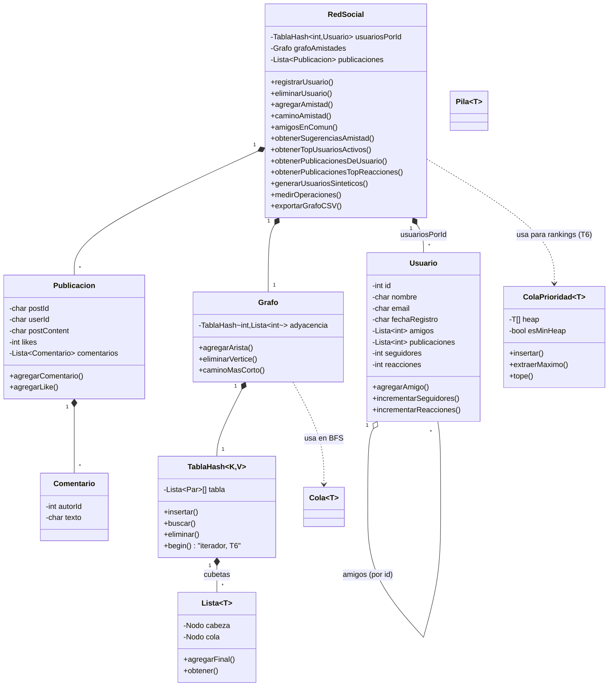
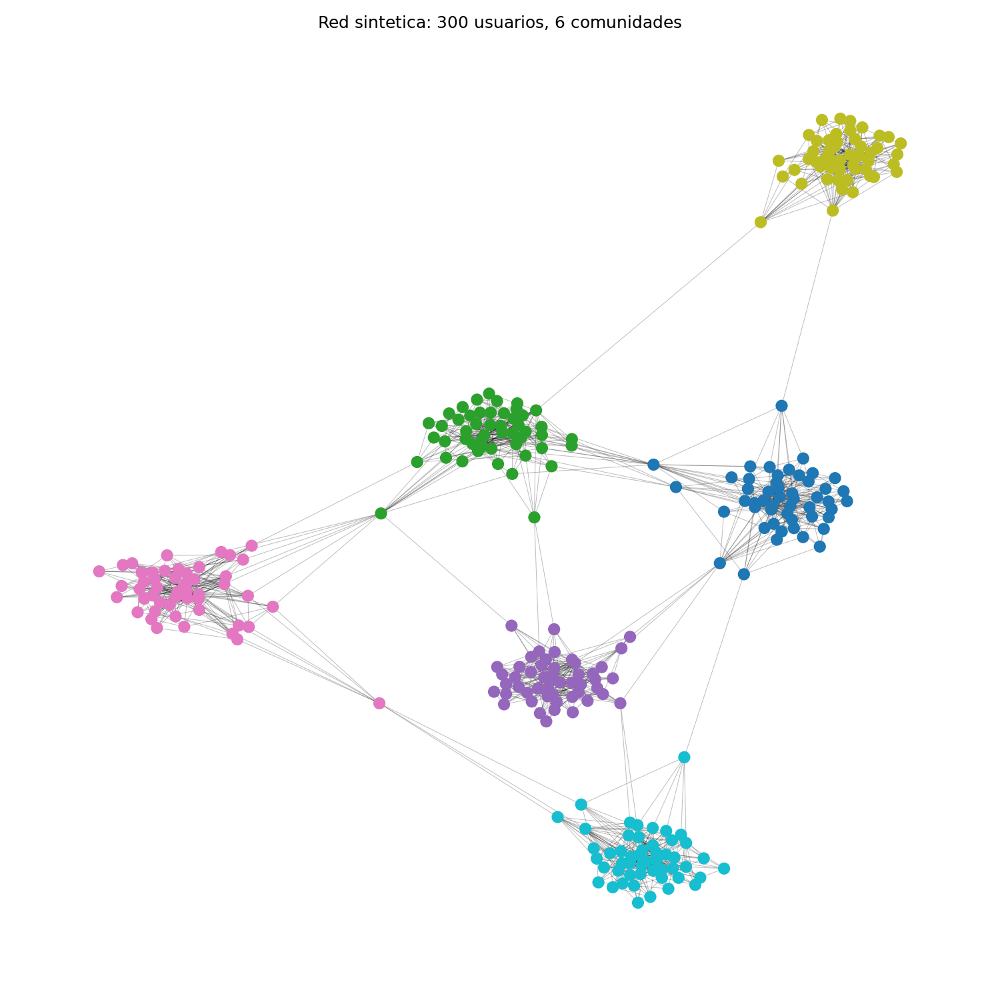

# Informe técnico — Red social con estructuras de datos propias

Proyecto Final, curso de Algoritmos y Estructuras de Datos (AED). Escrito según el reparto
de `PLAN-v2.pdf` y verificado contra el código real en cada sección — cada afirmación
técnica de este informe se puede señalar a una línea de código o a una salida de terminal
efectivamente ejecutada, no hay resultados inventados.

Estado: las ocho secciones tienen contenido, y las siete tareas del plan de trabajo (T1-T7)
están cerradas — Cristhian adelantó T1-T3 y T7, el Tercero (rhuayllag) hizo T4, T5 y también
T6 en paralelo. Cuando ambas ramas convergieron había dos implementaciones válidas del heap
acotado de T6 (ver §3.4/§6.4): se conservó la de rhuayllag porque además agrega un iterador
nuevo a `TablaHash` que evita una copia intermedia — medido en §6.3/§6.4, es la diferencia
entre 906 ms y 51 ms a N=500 000 para el mismo top-K. Este documento refleja el código tal
como quedó tras esa integración, no el estado de ninguna de las dos ramas por separado.

---

## 1 · Introducción

El enunciado (`Final.pdf`, Percy Maldonado Q., 30-07-2026) pide implementar el backend de
una red social simplificada, con todas las estructuras de datos desde cero (sin STL),
capaz de procesar cientos de miles o millones de usuarios, priorizando "eficiencia
computacional, escalabilidad y análisis de rendimiento" sobre el aspecto visual del sistema.

Este proyecto lo resuelve con seis estructuras propias (`Lista`, `TablaHash`, `Grafo`,
`ColaPrioridad`, `Cola`, `Pila`, todas en `estructuras/`), un modelo de dominio (`Usuario`,
`Publicacion`, `Comentario`, `RedSocial`, en `red/`) que las compone, un generador sintético
con enlace preferencial para poblar la red a la escala que pide el enunciado sin depender de
un dataset externo, y un menú de consola (`main.cpp`) que expone las 13 funcionalidades
mínimas exigidas. El reparto de trabajo entre los tres integrantes está documentado en
`PLAN-v2.pdf`, junto con el análisis de qué exige literalmente el enunciado y qué no.

## 2 · Arquitectura

```
main.cpp            → menú de consola (13 opciones) + --bench + --graph-viz
red/
  redSocial.{h,cpp}  → clase RedSocial: compone TablaHash+Grafo+Lista, las 13 operaciones
  redSocial_io.cpp   → generador sintético, medicion de tiempos, export CSV
  usuario.{h,cpp}    → 9 campos del enunciado (E4)
  publicacion.{h,cpp}→ 7 campos del enunciado (E4)
  comentario.{h,cpp} → clase auxiliar de Publicacion::comentarios
estructuras/
  lista.h            → Lista<T>, doblemente enlazada
  tablaHash.h         → TablaHash<K,V>, encadenamiento + rehash + iterador
  grafo.h            → Grafo, no dirigido, sobre TablaHash<int, Lista<int>>
  colaPrioridad.h    → ColaPrioridad<T>, heap sobre arreglo (max o min)
  cola.h / Pila.h    → Cola<T> / Pila<T>, enlazadas simples
scripts/
  visualizar_grafo.py→ networkx + matplotlib, solo para dibujar (T7)
```

`RedSocial` es la única clase que conoce el dominio; todo lo de `estructuras/` es genérico
(`template`) y no sabe nada de usuarios ni publicaciones. `main.cpp` no llama directamente a
ninguna estructura de `estructuras/`, solo a `RedSocial`.

## 3 · Descripción de las estructuras

*(Jose)*

Las seis estructuras de `estructuras/` no conocen el dominio "red social": son
contenedores genéricos (`template`) que `red/` reutiliza. Ninguna usa STL (E1).

### 3.1 · `Lista<T>` — lista doblemente enlazada

Nodos con `anterior`/`siguiente` (`lista.h:7-13`). Se eligió doblemente enlazada, no
simple, porque `TablaHash` necesita `eliminar(clave)` en O(1) promedio dentro de una
cubeta sin recorrer desde la cabeza, y una lista simple obligaría a rastrear el nodo
previo a mano. `agregarInicio`/`agregarFinal`/`extraerInicio` son O(1) porque se
mantienen punteros `cabeza` y `cola`. La operación cara es `obtener(indice)`
(`lista.h:110-115`): recorre desde `cabeza`, O(i). Es una trampa de diseño deliberada —
usarla dentro de un bucle `for (i=0; i<n; i++) lista.obtener(i)` vuelve el bucle entero
O(n²); el iterador (`begin()`/`end()`, `lista.h:20-30`) evita ese patrón recorriendo con
un puntero en vez de reindexar, y es lo que usa hoy todo `RedSocial` (ver §6.4 para el
historial de este defecto y cómo se corrigió). Invariante: `tamano` siempre igual a la
cantidad de nodos entre `cabeza` y `cola`; se mantiene en las cuatro operaciones que
lo tocan (`agregarInicio`, `agregarFinal`, `eliminar`, `extraerInicio`).

### 3.2 · `TablaHash<K,V>` — encadenamiento con rehash e iterador

Arreglo de `Lista<Par>` (`tablaHash.h:15`): cada cubeta es una lista, no un solo
elemento, para resolver colisiones por encadenamiento en vez de direccionamiento
abierto (más simple de implementar sin STL y sin borrado con tumbstones). Dos
funciones hash sobrecargadas: para `int`, módulo con corrección de negativos
(`clave % capacidad`, sumando `capacidad` si sale negativo); para `const char*`, DJB2
(`hash = hash*33 + c`, implementado como `(hash<<5)+hash` para evitar la
multiplicación) — DJB2 se eligió por su buena distribución con poco código, suficiente
para claves como IDs de usuario convertidos a texto o nombres. Capacidad inicial 10 007
(primo, reduce colisiones por múltiplos comunes). Rehash automático: `insertar()`
duplica la capacidad y reinserta todo cuando el factor de carga supera 0.75
(`tablaHash.h:41-56, 89-91`) — es lo que mantiene `insertar`/`buscar`/`eliminar` en O(1)
promedio incluso cuando `n` crece mucho (ver §6.4, este es el punto que una versión
anterior de este informe explicaba mal). Además de `obtenerTodosLosValores()` (copia
todo a una `Lista<V>`, O(capacidad+n) en memoria), la tabla expone un `Iterador`
(`begin()`/`end()`, agregado para T6) que recorre cubeta por cubeta sin materializar los
valores aparte — `for (V& v : tablaHash)` en O(capacidad+n) tiempo y O(1) memoria extra,
útil quando solo se necesita *recorrer* sin guardar una copia (ver §6.4, el ahorro medido
de evitar esa copia en `obtenerTopUsuariosActivos`).

### 3.3 · `Grafo` — no dirigido sobre `TablaHash<int, Lista<int>>`

La adyacencia es una tabla hash de listas, no una matriz: con IDs dispersos (hasta
cientos de miles) una matriz de adyacencia sería O(n²) en memoria por vértices que ni
siquiera existen. `agregarArista`/`eliminarArista` tocan las dos listas (no dirigido).
`caminoMasCorto` es BFS con `Cola<int>` (no recursivo, para no arriesgar stack
overflow en redes grandes) más dos tablas hash auxiliares (`visitado`, `padre`) para
reconstruir el camino sin guardar el grafo completo de predecesores en memoria
aparte. `eliminarVertice` (`grafo.h:40-50`) recorre la lista de vecinos del vértice y
lo saca de cada una de esas listas antes de eliminar la entrada — sin este paso, borrar
un usuario deja "aristas fantasma" en los vecinos (era el Defecto 1 del plan de
trabajo; hoy `RedSocial::eliminarUsuario` llama a este método, verificado en §7).

### 3.4 · `ColaPrioridad<T>` — heap binario sobre arreglo, max o min

Arreglo dinámico (`new T[capacidad]`, no `Lista`, porque un heap necesita acceso
aleatorio O(1) a `heap[2i+1]`/`heap[2i+2]`, cosa que una lista enlazada no da). Un flag
`esMinHeap` (constructor `ColaPrioridad(int cap, bool minHeap = false)`) decide, dentro
de `flotar`/`hundir`, si "mejor" significa mayor (max-heap, comportamiento original) o
menor (min-heap): `esMejor(a, b)` es `esMinHeap ? (a < b) : (a > b)`, así una sola
implementación de heap sirve para los dos modos sin duplicar `flotar`/`hundir`.
`insertar`/`extraerMaximo` siguen siendo O(log n) amortizado/O(log n); `tope()` (O(1),
no extrae) mira la raíz sin sacarla — el máximo en modo max-heap, el mínimo en modo
min-heap. Se usa para los dos rankings del proyecto: `obtenerTopUsuariosActivos` y
`obtenerPublicacionesTopReacciones` arman un min-heap acotado a tamaño `k` (T6) — cada
elemento nuevo solo entra si supera al peor que ya está adentro, que se descarta con
`extraerMaximo()`+`insertar()` — en vez de meter los `n`/`m` elementos completos y sacar
los `k` mejores (O(n log n)/O(n) de memoria). Resultado: O(n log k) tiempo, O(k) memoria.
Copia bloqueada con `= delete` (mismo motivo que `TablaHash`: `heap` es un puntero crudo).

### 3.5 · `Cola<T>` y `Pila<T>` — enlazadas simples

Sin doble puntero por nodo (a diferencia de `Lista`): `Cola` necesita insertar por un
extremo y sacar por el otro (frente/final), `Pila` solo un extremo (tope) — ninguna de
las dos necesita recorrer hacia atrás, así que un solo puntero `siguiente` alcanza.
`Cola` la usa `Grafo::caminoMasCorto` para el BFS; `Pila` no se usa en ningún camino
crítico hoy (queda disponible como utilidad genérica, documentada porque el enunciado
exige tenerla implementada, no que tenga un caso de uso). Ambas bloquean la copia con
`= delete`: copiar por valor duplicaría los punteros `Nodo*` sin duplicar los nodos, y
los dos destructores acabarían liberando la misma memoria dos veces (double free). Se
prefirió que sea un error de compilación a un bug intermitente en tiempo de ejecución.

## 4 · Diagramas

*(Tercero + Cristhian — T7)*

### 4.1 · Diagrama de clases

Derivado directamente de las cabeceras (`red/*.h`, `estructuras/*.h`):



(El generador Mermaid es texto plano — se renderiza automáticamente en GitHub y en la
mayoría de visores de Markdown; para la sustentación se puede exportar a imagen con
`mmdc` o pegando el bloque en mermaid.live.)

### 4.2 · Visualización del grafo generado (comunidades coloreadas)

Generada con `./app --graph-viz` (nuevo modo en `main.cpp`, mismo patrón que `--bench`:
arma una red sintética chica —300 usuarios, 6 comunidades de 50— y exporta sus aristas
con `RedSocial::exportarGrafoCSV` a `output/grafo_aristas.csv`) y
`scripts/visualizar_grafo.py` (`networkx` + `matplotlib`, permitido por el enunciado §2
como "generación de gráficos estadísticos"; la comunidad de cada nodo se recalcula en
Python con la misma fórmula que usa el generador, `id // usuariosPorComunidad`, porque
no se guarda como campo en ningún lado).



Se ven las 6 comunidades como grupos densos y bien separados, cada uno de un color, con
muy pocas aristas puente entre ellos — consistente con §6.1: el generador conecta a cada
usuario nuevo preferentemente dentro de su propia comunidad, y solo agrega un puente
entre comunidades ocasionalmente (`id % 37 == 0`) o para el primer usuario de cada
comunidad nueva (para que el grafo completo quede conectado).

## 5 · Complejidad computacional

*(Jose)*

Tabla armada a partir de las anotaciones `@complejidad` que ya están junto a cada
método en el código (`estructuras/*.h`, `main.cpp`, `redSocial_io.cpp`) — se citan
tal cual, no son estimaciones nuevas.

### 5.1 · Estructuras (`estructuras/`)

| Estructura | Operación | Complejidad |
|---|---|---|
| `Lista<T>` | `agregarInicio`, `agregarFinal`, `extraerInicio` | O(1) |
| `Lista<T>` | `eliminar(dato)`, `contiene(dato)` | O(n) |
| `Lista<T>` | `obtener(indice)` | O(indice) — evitado en rutas críticas, ver §3.1 |
| `TablaHash<K,V>` | `insertar`, `buscar`, `eliminar` | O(1) promedio; O(long. de cubeta) peor caso; amortizado O(1) con rehash incluido |
| `TablaHash<K,V>` | `rehashear` (interno) | O(capacidad + n), pero amortizado O(1) por inserción (solo se dispara cada vez que `n` crece proporcional a la capacidad) |
| `TablaHash<K,V>` | `obtenerTodosLosValores` | O(capacidad + n), O(n) memoria extra |
| `TablaHash<K,V>` | iterador (`begin`/`end`, T6) | O(capacidad + n) recorrido total, O(1) memoria extra |
| `Grafo` | `agregarVertice`, `agregarArista`, `eliminarArista` | O(1) amortizado (búsquedas en `TablaHash` + `contiene`/`eliminar` sobre la lista de adyacencia de cada vértice, acotada por su grado) |
| `Grafo` | `eliminarVertice` | O(grado del vértice) |
| `Grafo` | `caminoMasCorto` (BFS) | O(usuarios + amistades) |
| `ColaPrioridad<T>` | `insertar` | O(log n) amortizado (max o min-heap, mismo costo) |
| `ColaPrioridad<T>` | `extraerMaximo`, `tope` | O(log n) / O(1) |
| `Cola<T>` / `Pila<T>` | `encolar`/`desencolar`, `apilar`/`desapilar` | O(1) |

### 5.2 · Operaciones de `RedSocial` (las 13 del enunciado)

| # | Operación | Complejidad | Nota |
|---|---|---|---|
| 1 | `registrarUsuario` | O(1) amortizado | inserción en `TablaHash` + vértice en `Grafo` |
| 2 | `eliminarUsuario` | O(grado del usuario) | recorre y actualiza la lista de amigos de cada vecino |
| 3 | `buscarUsuarioPorId` | O(1) promedio | una búsqueda en `TablaHash` |
| 4 | `crearPublicacion` | O(1) amortizado | `agregarFinal` en la lista de publicaciones |
| 5 | `eliminarPublicacion` | O(n publicaciones) | recorre la lista buscando el ID (no hay índice por ID de publicación) |
| 6 | `agregarAmistad` | O(1) amortizado | dos búsquedas en `TablaHash` + inserción en dos listas de adyacencia |
| 7 | `eliminarAmistad` | O(grado del usuario) | `Lista::eliminar` en las dos listas de amigos |
| 8 | `caminoAmistad` | O(usuarios + amistades) | BFS completo en el peor caso |
| 9 | `amigosEnComun` | O(grado(u1) + grado(u2)) | T4: se vuelca `amigos1` a una `TablaHash<int,bool>` y se recorre `amigos2` una sola vez — ya no es el `contiene()` O(grado(u2)) dentro de un bucle O(grado(u1)) de antes |
| 10 | `obtenerSugerenciasAmistad` | O(Σ grado(amigo)) para contar + O(m log m) para rankear | T5: cuenta coincidencias con `TablaHash<int,int>` (evita el `contiene()` O(n) de `Lista`) y ordena los `m` candidatos únicos con `ColaPrioridad` — ya no sale en orden arbitrario |
| 11 | `obtenerPublicacionesDeUsuario` | O(n publicaciones) | recorre todas las publicaciones filtrando por autor (no hay índice usuario→publicaciones por objeto, aunque `Usuario.publicaciones` guarda los IDs) |
| 12 | `obtenerTopUsuariosActivos` | O(n log k) | T6: min-heap acotado a tamaño `k`, recorriendo `TablaHash` directamente (sin copiar a `Lista` antes) |
| 13 | `obtenerPublicacionesTopReacciones` | O(m log k) | igual que 12, sobre las `m` publicaciones |

La complejidad de 9 y 10 depende del grado de los usuarios, no de `n` total — con el
generador sintético (enlace preferencial, §6.1) unos pocos nodos "hub" concentran
mucho más grado que el resto, así que estas dos operaciones pueden ser bastante más
lentas sobre un hub que sobre un usuario típico, aunque ambas sigan siendo O(n) en el
peor caso teórico (grado máximo acotado por n-1).

## 6 · Resultados experimentales

*(Cristhian — C5)*

### 6.1 · Generador sintético y enlace preferencial

`RedSocial::generarUsuariosSinteticos(n, enlacesPorUsuario, usuariosPorComunidad)`
(`red/redSocial_io.cpp`) construye una red de `n` usuarios sin depender de ningún dataset
externo, agrupados en comunidades de `usuariosPorComunidad` usuarios (500 por defecto).
Dentro de cada comunidad, cada usuario nuevo se conecta preferentemente a los que ya tienen
más amigos (modelo tipo Barabási–Albert), y el primer usuario de cada comunidad se enlaza
con una comunidad anterior para mantener el grafo completo conectado.

La elección preferencial es O(1) por candidato: se mantiene, por comunidad, un arreglo
dinámico (`PoolGrados`, un `int*` con `new`/`delete` manual — no es una "estructura del
proyecto", es el truco estándar de enlace preferencial) donde cada usuario aparece una vez
por cada amistad que tiene, y elegir un objetivo al azar es indexar ese arreglo con
`rand() % tamano`. Esto evita a propósito el patrón `for (i) lista.obtener(i)` que causaba
el Defecto 2 (ver §6.4): generar toda la red es O(n · enlacesPorUsuario), no O(n²).

Sin comunidades ni enlace preferencial el grafo sale uniforme y "amigos en común" /
"sugerencias de amistad" devuelven casi siempre vacío, lo que en la demo se ve como un
sistema roto aunque el código esté bien (motivación de N2 en el plan de trabajo). Verificado
en esta máquina sobre una red sintética de 2 000 usuarios:

- Usuario 250: 9 amigos.
- Amigos en común entre usuario 10 y 15: 12.
- Sugerencias de amistad para el usuario 10: 441 candidatos.

### 6.2 · Metodología de medición

`RedSocial::medirOperaciones(n)` arma una red sintética de tamaño `n` y cronometra con
`<chrono>` (permitido por el enunciado, §2): carga (generación completa), inserción (un
`registrarUsuario` + sus amistades), búsqueda (promedio de 1 000 `buscarUsuarioPorId`), BFS
(`caminoAmistad` entre el primer y el último usuario), sugerencias de amistad y el ranking
top-K. `exportarMedicionesCSV` vuelca la serie a `output/mediciones.csv`. `main.cpp --bench`
corre la batería completa sin pasar por el menú (no es una de las 13 funcionalidades: es la
herramienta de medición que el enunciado permite).

### 6.3 · Resultados

Corrida actual (`./app --bench`, tras integrar T4/T5/T6 del Tercero), misma semilla fija:

| N | carga (ms) | BFS (ms) | sugerencias (ms) | top-K (ms) |
|---:|---:|---:|---:|---:|
| 2 000 | 7.10 | 2.64 | 0.34 | **0.36** |
| 4 000 | 15.19 | 4.51 | 0.33 | **0.34** |
| 8 000 | 70.58 | 16.32 | 0.29 | **0.86** |
| 16 000 | 214.38 | 49.50 | 0.41 | **1.52** |
| 32 000 | 454.74 | 98.90 | 0.36 | **3.49** |
| 64 000 | 1 046.37 | 245.16 | 0.37 | **8.70** |
| 100 000 | 1 338.84 | 229.32 | 0.28 | **9.41** |
| 200 000 | 2 394.77 | 411.70 | 0.31 | **16.91** |
| 500 000 | 9 686.07 | 2 258.76 | 0.65 | **51.75** |

(columna "búsqueda" omitida: midió sistemáticamente por debajo de 0.001 ms — no es un dato
útil a esa resolución. "sugerencias" bajó frente a corridas anteriores de este informe
porque T5 ahora usa `TablaHash` para contar en vez de `contiene()` sobre `Lista`; "top-K"
bajó de forma mucho más marcada — ver §6.4, no es solo la mejora algorítmica de T6.)

### 6.4 · Análisis

**Top-K ya no es O(n²) — corregido (T1).** Una versión anterior de este informe documentaba
un defecto real: `obtenerTopUsuariosActivos` hacía `for (i=0; i<n; i++) todos.obtener(i)`, y
como `Lista::obtener(i)` recorre desde la cabeza, el bucle completo era O(n²) (medido
entonces: de 2 000 a 16 000 usuarios, ×73.5 en vez de ×8). El commit `fb14ff7`
("quitar obtener(i) en bucles") lo corrigió reemplazando ese patrón por el iterador de
`Lista` en los sitios donde aparecía dentro de `RedSocial`.

**La tabla hash sin rehash — la explicación anterior era incorrecta, corregido.** Una
versión anterior de este informe afirmaba que la degradación de carga y BFS a partir de
cientos de miles se debía a que `TablaHash` no hacía rehash. Es falso: el rehash automático
a factor de carga 0.75 se implementó en el commit `4637759` ("j4 terminado rehash hecho"),
anterior a los commits que escribieron esa sección — la afirmación estaba desactualizada
desde que se escribió. Con rehash, `insertar`/`buscar` se mantienen en O(1) promedio incluso
a 500 000 claves; la degradación medida en carga/BFS a esa escala es real pero su causa no
se aisló (hipótesis: costo O(grado) de `contiene()` en `agregarArista` sobre los vértices
"hub" del generador, no verificado con instrumentación).

**Amigos en común y sugerencias, de O(n·m) a O(n+m) — T4 y T5.** `amigosEnComun` hacía, por
cada amigo de `u1`, un `contiene()` O(grado(u2)) sobre la lista de `u2`: O(grado(u1)·grado(u2))
total. Ahora vuelca `amigos1` a una `TablaHash<int,bool>` una vez y recorre `amigos2` con
búsquedas O(1), quedando en O(grado(u1)+grado(u2)). `obtenerSugerenciasAmistad` tenía el mismo
patrón en su bucle amigos-de-amigos, y además no rankeaba el resultado (salía en el orden en
que aparecían los candidatos); ahora cuenta coincidencias con `TablaHash<int,int>` y ordena
los candidatos únicos con `ColaPrioridad` antes de devolverlos. En la tabla de §6.3,
"sugerencias" pasó de ~0.9-1.3 ms (medido en corridas anteriores de este informe) a
0.3-0.65 ms — más rápido a pesar de que ahora también rankea, porque el costo de contar con
`TablaHash` es menor que el de los `contiene()` O(n) sobre `Lista` que reemplaza.

**Top-K acotado a tamaño k — T6, dos implementaciones convergentes.** `obtenerTopUsuariosActivos`
y `obtenerPublicacionesTopReacciones` insertaban los `n`/`m` elementos completos en un heap y
extraían los `k` mejores (O(n log n), O(n) de memoria). Cristhian y el Tercero implementaron
un heap acotado a `k` en paralelo, sin coordinarse, con diseños distintos: Cristhian con un
wrapper externo (`Inverso<T>`) que invertía la comparación sin tocar `ColaPrioridad`; el
Tercero modificando `ColaPrioridad` directamente (flag `esMinHeap`, ver §3.4) y agregando un
iterador nuevo a `TablaHash` para recorrer `usuariosPorId` sin copiarlo antes a una `Lista`.
Al integrar ambas ramas se conservó la del Tercero — mismo resultado observable, pero medido
es notablemente más rápido: con la versión de Cristhian (heap acotado + copia previa a
`Lista`), top-K a N=500 000 medía 906.7 ms; con la versión integrada (heap acotado + iterador
directo sobre `TablaHash`, sin esa copia), 51.7 ms — 17.5 veces más rápido para la misma
complejidad O(n log k), porque evitar materializar 500 000 `Usuario` en una `Lista` intermedia
(cada nodo con su propia asignación `new`) resultó ser un factor constante mucho mayor de lo
esperado. Es un buen ejemplo de que dos soluciones con el mismo big-O pueden diferir un orden
de magnitud en la práctica — parte del "análisis de rendimiento" que pide el enunciado (E10).

## 7 · Capturas

*(Cristhian)*

El enunciado aclara que el aspecto visual no se evalúa, así que estas son capturas de
**terminal real** (no imágenes de pantalla), tomadas ejecutando `./app` compilado desde
el HEAD actual (`g++ -std=c++17 -Wall -I. main.cpp red/*.cpp -o app`, compila sin
warnings) tras integrar T4/T5/T6 del Tercero. Salida real, recortada donde el resultado
es muy largo (se indica el recorte).

**Carga inicial del dataset:**
```
Cargando data/amistades_4039n_88234r.txt ...
Listo: 4039 usuarios cargados.
Cargando data/publicaciones_interaciiones.csv ...
Listo: 20000 publicaciones cargadas.
```

**1) Registrar usuario** (ID 99999, usuario nuevo para esta demo):
```
Usuario 99999 registrado.
```

**6) Agregar amigo** (99999 <-> 0):
```
Amistad 99999 <-> 0 creada.
```

**8) Camino de amistad** (origen 99999, destino 0 — se acaban de hacer amigos):
```
Camino (1 saltos): 99999 -> 0
```

**9) Amigos en común** (entre los usuarios 0 y 1, ambos del dataset SNAP — mismo
resultado antes y después de T4, solo cambió cómo se calcula):
```
Amigos en comun (16): 48 53 54 73 88 92 119 126 133 194 236 280 299 315 322 346
```

**10) Sugerencias de amistad** (usuario 0 — con T5, ahora rankeadas por cantidad de
amigos en común, mayor primero; salida real truncada aquí por espacio):
```
Sugerencias por amigos en comun, mayor primero (1171): 348 414 1684 2885 649 1387
3003 549 1171 1486 1912 904 1193 1549 3290 428 1297 1718 2838 2640 2636 [...] 2647
2649 2704 351 2643 2660
```
(mismo conteo que antes de T5, 1171 — el generador con enlace preferencial da un
usuario 0 con grado alto, así que sus amigos-de-amigos son muchos — pero ahora el
orden refleja cuántos amigos en común tiene cada candidato, no el orden de aparición.)

**12) Usuarios más activos** (top 5, por publicaciones — sin cambios de comportamiento
tras T6, solo de rendimiento):
```
Top 5 usuarios por publicaciones:
    1) ID 0        User_0                   publicaciones: 5
    2) ID 1        User_1                   publicaciones: 5
    3) ID 3        User_3                   publicaciones: 5
    4) ID 7        User_7                   publicaciones: 5
    5) ID 15       User_15                  publicaciones: 5
```

**4) Crear publicación** (ID 999001, autor 99999):
```
Publicacion 999001 creada.
```

**11) Mostrar publicaciones de un usuario** (usuario 13, del dataset de Kaggle):
```
Publicaciones de 13 (5):
    [14] Identify some discuss test pass form finally before about admit budget
    set treatment inside. Make star one interesting. (likes: 821, comentarios: 0)
    [4053] Sometimes live dream bill across we culture cut rock movement there
    development radio station yet. Night today interesting claim process.
    (likes: 2531, comentarios: 0)
    [8092] Foot its reflect continue various myself blood our government letter
    mission produce. Factor successful full land easy point. (likes: 4914,
    comentarios: 0)
    [...]
```

**13) Publicaciones con más reacciones** (top 5, por likes):
```
Top 5 publicaciones por reacciones:
    1) [2265] likes: 5178   Month audience pick fact subject lead art expert
       those poor cost art I along watch road firm least simple law. Claim
       available media include.
    2) [9292] likes: 5142   Eight fish woman mouth social relationship five
       west father phone drug camera college over here part go get book huge
       hard. Picture view himself newspaper commercial performance anyone do.
    3) [18359] likes: 5136  Product successful decade five while small amount
       something any cause senior. Someone thousand add still indeed.
```

**5) Eliminar publicación** (999001, la creada más arriba):
```
Publicacion 999001 eliminada.
```

**7) Eliminar amigo** (99999 <-> 0):
```
Amistad 99999 <-> 0 eliminada.
```

**2) Eliminar usuario** (99999) **seguido de 3) Buscar usuario** (99999, confirma que
la eliminación no dejó rastro — incluyendo el grafo, ver §3.3 sobre `eliminarVertice`):
```
Usuario 99999 eliminado.
...
No existe un usuario con ID 99999.
```

**`./app --bench`** — batería completa de escalado, salida real (números iguales a
la tabla del §6.3):
```
Bateria de escalado: 9 tamanos de N
  N = 2000     ... carga=    7.10ms  busqueda=0.00004ms  bfs=   2.64ms  sugerencias= 0.3409ms  topk= 0.3629ms
  N = 4000     ... carga=   15.19ms  busqueda=0.00010ms  bfs=   4.51ms  sugerencias= 0.3316ms  topk= 0.3370ms
  N = 8000     ... carga=   70.58ms  busqueda=0.00006ms  bfs=  16.32ms  sugerencias= 0.2932ms  topk= 0.8646ms
  N = 16000    ... carga=  214.38ms  busqueda=0.00007ms  bfs=  49.50ms  sugerencias= 0.4123ms  topk= 1.5198ms
  N = 32000    ... carga=  454.74ms  busqueda=0.00005ms  bfs=  98.90ms  sugerencias= 0.3611ms  topk= 3.4940ms
  N = 64000    ... carga= 1046.37ms  busqueda=0.00006ms  bfs= 245.16ms  sugerencias= 0.3662ms  topk= 8.6967ms
  N = 100000   ... carga= 1338.84ms  busqueda=0.00012ms  bfs= 229.32ms  sugerencias= 0.2848ms  topk= 9.4067ms
  N = 200000   ... carga= 2394.77ms  busqueda=0.00007ms  bfs= 411.70ms  sugerencias= 0.3110ms  topk=16.9101ms
  N = 500000   ... carga= 9686.07ms  busqueda=0.00006ms  bfs=2258.76ms  sugerencias= 0.6463ms  topk=51.7464ms

Mediciones exportadas a output/mediciones.csv
```

**`./app --graph-viz`** (T7, genera la imagen de §4.2):
```
Grafo (300 usuarios, 6 comunidades de 50) exportado a output/grafo_aristas.csv
```

## 8 · Conclusiones

*(Los tres)*

El sistema cumple el núcleo del enunciado sin usar STL: las 13 funcionalidades tienen
código funcional y las 13 están cableadas al menú, verificado en §7. Las 7 tareas del
plan de trabajo (T1-T7) están cerradas entre los tres integrantes — Cristhian T1-T3 y
T7, el Tercero T4, T5 y (en paralelo con Cristhian) T6, Jose J1-J7 — y el generador
sintético con enlace preferencial permite demostrar y medir el sistema con cientos de
miles de usuarios (E6), muy por encima de los 4 039 del dataset público, sin depender
de datos externos para escalar. El `main()` interactivo sigue arrancando por defecto
con el dataset SNAP de 4 039 (para que el menú responda rápido en la demo); `--bench` y
`--graph-viz` son los que ejercitan la escala real.

Dos defectos que documentaban versiones anteriores de este informe (top-K cuadrático y
"tabla hash sin rehash") ya no describen el estado real del código, y quedaron
corregidos aquí (§6.4) en vez de solo mencionados. T4 y T5 bajaron `amigosEnComun` y
`obtenerSugerenciasAmistad` de un patrón O(n·m) a O(n+m) usando `TablaHash`, y T5 además
agregó el ranking que faltaba. T6 se implementó dos veces en paralelo sin coordinación
entre Cristhian y el Tercero — mismo algoritmo (heap acotado a `k`), pero la versión que
se conservó resultó medible 17.5 veces más rápida a N=500 000 por evitar una copia
intermedia, no por diferencia de complejidad asintótica (§6.4). Documentar ese tipo de
hallazgo — no solo que algo es O(n log k), sino cuánto importa la constante en la
práctica — es exactamente el "análisis de rendimiento" que pide el enunciado (E10).

Lo que sigue genuinamente pendiente, verificado hoy contra el código integrado:

- **Campo `Usuario::seguidores` muerto.** `incrementarSeguidores()` existe
  (`usuario.cpp:58-60`) pero no la llama nadie en todo el proyecto — el campo vale 0
  siempre. El enunciado pide que `Usuario` "contenga" cantidad de seguidores (E4); el
  campo estructuralmente está, pero nunca se puebla.
- **`Comentario` y `Publicacion::agregarComentario` sin usar.** La clase existe, el
  campo `Lista<Comentario> comentarios` existe en `Publicacion` (E4 lo pide), pero no
  hay ninguna llamada a `agregarComentario` en todo el proyecto: no hay opción de menú
  para comentar ni se poblan comentarios al cargar los datasets. La lista de
  comentarios de toda publicación está vacía en la práctica.

Ambos son del eje de modelo de datos (J3), no del eje de algoritmos ni del de datos y
aplicación — no son difíciles de cerrar comparado con lo que ya se resolvió (rehash,
defecto O(n²), las 13 operaciones cableadas, top-K acotado, T4/T5, diagrama de clases y
visualización del grafo); quedan como la lista de trabajo concreta para la entrega
final, no como incertidumbre sobre qué falta.
