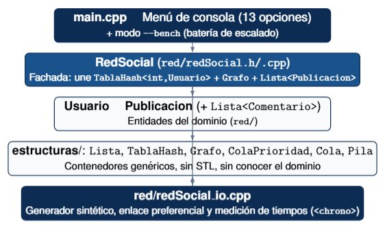

<div align="center">
  

  # CompuBook
  ### Red Social con Estructuras de Datos Propias

  
  
  
  

  **Universidad Nacional de San Agustín de Arequipa** · Escuela Profesional de Ciencia de la Computación
  Curso: *Algoritmos y Estructuras de Datos* (2026-A) · Docente: Percy Maldonado Q.

  **Autores:** Cristhian Taipe — `ctaipe@unsa.edu.pe` · Jose Tumpay — `jtumpay@unsa.edu.pe` · Roid N. Huaylla Guzmán — `rhuayllag@unsa.edu.pe`
</div>

---

## Tabla de Contenidos

- [Introducción](#introducción)
- [Objetivos](#objetivos)
- [Arquitectura General](#arquitectura-general)
- [Descripción de las Estructuras Utilizadas](#descripción-de-las-estructuras-utilizadas)
  - [Lista\<T\> — doblemente enlazada](#listat--doblemente-enlazada)
  - [TablaHash\<K,V\> — encadenamiento con Lista\<Par\>](#tablahashkv--encadenamiento-con-listapar)
  - [Grafo — no dirigido, sobre TablaHash](#grafo--no-dirigido-sobre-tablahash)
  - [ColaPrioridad\<T\> — heap binario](#colaprioridadt--heap-binario)
  - [Cola\<T\> y Pila\<T\>](#colat-y-pilat)
- [Funcionalidades Implementadas](#funcionalidades-implementadas)
- [Diagramas](#diagramas)
- [Complejidad Computacional](#complejidad-computacional)
- [Estructura del Repositorio](#estructura-del-repositorio)
- [Requisitos y Compilación](#requisitos-y-compilación)
- [Uso](#uso)
- [Resultados Experimentales](#resultados-experimentales)
- [Informe Técnico Completo](#informe-técnico-completo)
- [Limitaciones Conocidas y Trabajo Futuro](#limitaciones-conocidas-y-trabajo-futuro)
- [Conclusiones](#conclusiones)

---

## Introducción

**CompuBook** es el núcleo de backend de una red social mínima, desarrollado en **C++17**
para el Proyecto Final del curso de Algoritmos y Estructuras de Datos (EPCC — UNSA). El
enunciado exige administrar usuarios, relaciones de amistad, publicaciones e interacciones
**sin usar ninguna estructura de datos de la STL** (`vector`, `list`, `map`,
`unordered_map`, `set`, `queue`, etc.): toda lista, tabla hash, grafo, cola, pila y cola de
prioridad que usa el sistema fue escrita desde cero, en el módulo `estructuras/`.

El sistema soporta las **13 funcionalidades mínimas** pedidas por el enunciado, expuestas a
través de un menú de consola (`main.cpp`) deliberadamente sobrio, ya que el propio enunciado
aclara que el aspecto visual del sistema no se evalúa.

Como fuente de datos se combinan tres orígenes:

- Un dataset público de amistades en formato **SNAP** (`data/amistades_4039n_88234r.txt`):
  4,039 usuarios y 88,234 aristas, tomado de la red social *ego-Facebook* de Stanford SNAP.
- Un **CSV de publicaciones e interacciones de Kaggle**
  (`data/publicaciones_interaciiones.csv`, 20,000 filas) para poblar contenido realista.
- Un **generador sintético propio** (`RedSocial::generarUsuariosSinteticos`), capaz de
  producir cientos de miles de usuarios con su grafo de amistades agrupado en comunidades,
  para medir escalabilidad muy por encima de lo que ofrece el dataset público.

## Objetivos

**Objetivo general:** implementar desde cero el núcleo de funcionamiento de una red social
similar a Facebook utilizando únicamente estructuras de datos propias, priorizando
eficiencia computacional, escalabilidad y análisis de rendimiento.

**Objetivos específicos:**

1. Diseñar e implementar seis estructuras de datos genéricas (`Lista`, `TablaHash`, `Grafo`,
   `ColaPrioridad`, `Cola`, `Pila`) sin depender de la STL de C++.
2. Modelar el dominio de una red social (usuarios, publicaciones, comentarios) sobre esas
   estructuras, cumpliendo los 9 campos de `Usuario` y los 7 de `Publicacion` exigidos.
3. Implementar las 13 funcionalidades mínimas del enunciado con una complejidad algorítmica
   justificada y documentada método por método.
4. Construir un generador sintético de usuarios con enlace preferencial (modelo tipo
   Barabási–Albert) para poder medir escalabilidad más allá del dataset público disponible.
5. Evaluar experimentalmente el sistema con redes de hasta 500,000 usuarios, cronometrando
   las operaciones principales con `<chrono>`.

## Arquitectura General

CompuBook sigue una arquitectura en capas, donde cada capa solo conoce a la inmediatamente
inferior:

<div align="center">
  
  <br/>
  <sub><em>Arquitectura en capas de CompuBook: main.cpp (menú de consola) → RedSocial (fachada) → Usuario / Publicacion (dominio) → estructuras/ (contenedores genéricos), con redSocial_io.cpp como generador sintético y medidor de tiempos.</em></sub>
</div>

Por requisito del enunciado, cada `Usuario` guarda su propia `Lista<int> amigos`; por
eficiencia de recorrido, el `Grafo` mantiene además su propia
`TablaHash<int, Lista<int>> adyacencia`. Es una duplicación deliberada, no un descuido: el
campo que exige el enunciado y el índice que necesita el BFS para ser eficiente no son la
misma responsabilidad. La sincronización entre ambos ocurre siempre dentro de la misma
operación (`agregarAmistad`, `eliminarAmistad`, `eliminarUsuario`):

```cpp
bool RedSocial::agregarAmistad(int id1, int id2) {
    Usuario* u1 = usuariosPorId.buscar(id1);
    Usuario* u2 = usuariosPorId.buscar(id2);
    if (u1 == nullptr || u2 == nullptr) return false;

    grafoAmistades.agregarArista(id1, id2); // indice de recorrido del BFS
    u1->agregarAmigo(id2);                  // campo que exige el enunciado
    u2->agregarAmigo(id1);
    return true;
}
```

`main.cpp` expone el menú interactivo de 13 opciones y, además, un modo `--bench` que arma
redes sintéticas de distintos tamaños y cronometra sus operaciones principales, exportando
la serie a `output/mediciones.csv`.

## Descripción de las Estructuras Utilizadas

Todas las estructuras de `estructuras/` son plantillas (`template <typename T>` o `<K,V>`)
para reutilizarse en distintos tipos sin duplicar código, y ninguna usa contenedores de la
STL: la memoria se gestiona a mano con `new`/`delete`.

### `Lista<T>` — doblemente enlazada

Estructura base de la que dependen todas las demás: `TablaHash` la usa para encadenamiento
por cubeta, `Grafo` para las listas de adyacencia. Se eligió doblemente enlazada porque
`eliminar(dato)` necesita reconectar el nodo anterior y siguiente sin recorrer la lista de
nuevo desde la cabeza. Expone un `Iterador` (`begin()`/`end()`) para recorrer en O(n) total;
`obtener(indice)` también existe, pero es O(n) por llamada — usarlo dentro de un bucle
degrada cualquier recorrido completo a O(n²), el primer defecto de rendimiento detectado y
corregido en el proyecto.

### `TablaHash<K,V>` — encadenamiento con `Lista<Par>`

Cada cubeta es una `Lista` de pares clave-valor. Se usan dos funciones hash: módulo directo
para claves enteras (los IDs son consecutivos) y **DJB2** (`hash = hash*33 + c`) para claves
de texto. La capacidad inicial es un primo (10,007). Cuando el factor de carga supera 0.75,
`insertar` dispara `rehashear()`: duplica la capacidad y reinserta todo — O(n) por rehash,
pero **amortizado O(1) por inserción**:

```cpp
void insertar(const K& clave, const V& valor) {
    int idx = funcionHash(clave);
    for (Par& p : tabla[idx]) {
        if (p.clave == clave) { p.valor = valor; return; }
    }
    tabla[idx].agregarFinal(Par(clave, valor));
    tamano++;
    if (tamano > (capacidad * 3) / 4) rehashear(); // O(n), amortizado O(1)
}
```

### `Grafo` — no dirigido, sobre `TablaHash`

Cada vértice es una clave de la tabla hash; su valor es la `Lista<int>` de sus vecinos, dando
acceso a la adyacencia en O(1) promedio. `caminoMasCorto` usa **BFS** clásico con una
`Cola<int>` para el recorrido y dos `TablaHash` auxiliares (`visitado`, `padre`) en vez de
arreglos, porque los IDs de usuario no son necesariamente un rango denso desde 0.

### `ColaPrioridad<T>` — heap binario

Heap binario sobre un arreglo (`T*`), indexado aritméticamente (hijos de `i` en `2i+1` y
`2i+2`). Admite modo *min-heap* (parámetro `esMinHeap`), lo que permite un **Top-K acotado**:
un min-heap de tamaño fijo `k` en vez de un heap con todos los elementos, usado en los dos
rankings del sistema (usuarios más activos, publicaciones con más reacciones).

### `Cola<T>` y `Pila<T>`

Listas enlazadas simples especializadas (nodo con un solo puntero `siguiente`). `Cola` es la
estructura auxiliar del BFS de `Grafo`; `Pila` queda documentada y lista para futuras
funcionalidades (por ejemplo, deshacer/rehacer una acción).

## Funcionalidades Implementadas

Las 13 funcionalidades mínimas del enunciado, cableadas al menú de consola:

- Registrar, eliminar y buscar usuarios
- Crear, eliminar y listar publicaciones de un usuario
- Agregar y eliminar amigos
- Camino de amistad más corto entre dos usuarios (BFS)
- Amigos en común entre dos usuarios
- Sugerencias de amistad (rankeadas por amigos en común)
- Usuarios más activos (Top-K por publicaciones)
- Publicaciones con más reacciones (Top-K por likes)

## Diagramas

El informe técnico completo (`informe.pdf`) incluye los diagramas visuales:

- **Grafo de amistades y BFS**: recorrido nivel por nivel desde un vértice origen hasta el
  destino, con la reconstrucción del camino más corto siguiendo la tabla de padres.
- **Top-K acotado con min-heap**: cómo un heap de tamaño fijo `k` descarta al peor candidato
  cada vez que llega uno mejor, sin crecer más allá de `k` elementos sin importar cuántos
  usuarios se procesen.

## Complejidad Computacional

| Operación | Complejidad | Justificación |
|---|---|---|
| Registrar / buscar usuario | O(1) promedio | `TablaHash::buscar`/`insertar` directo |
| Agregar / eliminar amistad | O(grado(u1)+grado(u2)) | domina `Grafo::agregarArista`/`eliminarArista` |
| Camino de amistad (BFS) | O(V + A) | cada vértice se encola una vez, cada arista se examina una vez |
| Amigos en común | O(grado(u1) + grado(u2)) | se vuelca un lado a `TablaHash<int,bool>` y se recorre el otro una sola vez |
| Sugerencias de amistad | O(A·B + c log c) | conteo con `TablaHash<int,int>` + orden con `ColaPrioridad` |
| Top-K usuarios/publicaciones | O(n log k) tiempo, O(k) memoria | min-heap acotado a `k` elementos, sin copiar los n elementos a una lista aparte |

El detalle método por método está documentado con anotaciones `@complejidad` en el propio
código fuente (`estructuras/*.h`, `red/redSocial.cpp`) y en el informe técnico completo.

## Estructura del Repositorio

```
CompuBook/
├── estructuras/              # Contenedores genéricos, sin STL, sin conocer el dominio
│   ├── lista.h                  Lista doblemente enlazada con iterador
│   ├── tablaHash.h               TablaHash<K,V>, encadenamiento con Lista<Par>
│   ├── grafo.h                    Grafo no dirigido sobre TablaHash<int, Lista<int>>; BFS
│   ├── colaPrioridad.h             Heap binario sobre arreglo (max-heap / min-heap)
│   ├── cola.h                       Cola (FIFO), auxiliar del BFS
│   └── Pila.h                        Pila (LIFO)
├── red/                       # Dominio: usuarios, publicaciones y la fachada RedSocial
│   ├── usuario.h/.cpp            Los 9 campos de Usuario
│   ├── publicacion.h/.cpp        Los 7 campos de Publicacion + Lista<Comentario>
│   ├── comentario.h/.cpp         Comentario individual
│   ├── redSocial.h/.cpp          Fachada: une TablaHash<int,Usuario> + Grafo + Lista<Publicacion>
│   └── redSocial_io.cpp          Generador sintético, enlace preferencial, medición de tiempos
├── data/                      # Datasets de entrada
│   ├── amistades_4039n_88234r.txt   Dataset SNAP ego-Facebook (4,039 usuarios, 88,234 aristas)
│   └── publicaciones_interaciiones.csv   Dataset de Kaggle (20,000 filas)
├── images/                    # Logo, diagrama de arquitectura y capturas del informe
│   ├── logo_compubook.png
│   ├── arquitectura.png
│   └── capturas/
├── output/                    # Binario compilado y mediciones exportadas (mediciones.csv)
├── main.cpp                   # Menú de consola (13 opciones) + modo --bench
├── informe.tex                # Informe técnico completo (LaTeX)
└── README.md
```

## Requisitos y Compilación

Requiere un compilador con soporte **C++17** (g++ ≥ 7, clang++ ≥ 5).

```bash
g++ -std=c++17 -O2 -o app main.cpp red/*.cpp
```

## Uso

```bash
# Menú interactivo
./app

# Bateria de medición de tiempos (sin pasar por el menú)
./app --bench
```

El modo `--bench` arma redes sintéticas de distintos tamaños, cronometra las operaciones
principales con `<chrono>` (búsqueda, BFS, sugerencias de amistad, Top-K) y exporta la serie
a `output/mediciones.csv`.

## Resultados Experimentales

Corridos sobre el `main` actual, semilla fija y reproducible:

| N | Carga (ms) | BFS (ms) | Sugerencias (ms) | Top-K (ms) |
|---:|---:|---:|---:|---:|
| 2,000 | 6.37 | 1.56 | 0.27 | 0.12 |
| 4,000 | 10.14 | 2.45 | 0.23 | 0.11 |
| 8,000 | 50.49 | 6.20 | 0.54 | 0.30 |
| 16,000 | 138.25 | 14.43 | 1.11 | 0.60 |
| 32,000 | 350.20 | 39.83 | 1.70 | 1.01 |
| 64,000 | 1,235.36 | 110.89 | 3.86 | 2.34 |
| 100,000 | 959.68 | 209.32 | 0.27 | 3.66 |
| 200,000 | 3,039.84 | 402.72 | 11.18 | 8.47 |
| 500,000 | 12,882.49 | 1,280.33 | 57.92 | 17.96 |

*La búsqueda puntual (promedio de 1,000 `buscarUsuarioPorId`) se mantiene por debajo de
0.001 ms en todo el rango medido, consistente con el O(1) promedio esperado de
`TablaHash::buscar`.*

Con el min-heap acotado, el tiempo de Top-K crece de forma aproximadamente lineal con `n`:
de 2,000 a 500,000 usuarios (×250) el tiempo pasa de 0.12 ms a 17.96 ms (×150), muy por
debajo de lo que predeciría una curva cuadrática. La carga y el BFS crecen más rápido que
`n` a partir de cientos de miles de usuarios, atribuible al volumen agregado de operaciones
encadenadas sobre la `TablaHash`, no a una regresión de complejidad en ninguna operación
individual (el detalle completo está en la Sección 6 del informe).

## Informe Técnico Completo

El análisis completo — introducción, arquitectura, descripción de estructuras, diagramas,
complejidad computacional, resultados experimentales y conclusiones — está en
[`informe.tex`](informe.tex) / `informe.pdf`.

## Limitaciones Conocidas y Trabajo Futuro

- Compactación periódica de `TablaHash` pendiente, para suavizar el costo agregado
  observado a partir de cientos de miles de claves.
- Sin persistencia en disco: la red se reconstruye en memoria en cada ejecución.
- `obtenerPublicacionesDeUsuario`/`darLike` recorren `publicaciones` en O(P); un índice por
  `postId` eliminaría ese recorrido cuando el volumen de publicaciones crezca
  significativamente.

## Conclusiones

- Se implementó el núcleo completo de una red social sin usar ninguna estructura de datos
  de la STL: las 13 funcionalidades exigidas están implementadas y cableadas al menú de
  consola, sobre seis estructuras propias escritas desde cero y documentadas método por
  método con su complejidad.
- El punto de mayor impacto en el rendimiento fue identificar y corregir el patrón
  `lista.obtener(i)` dentro de bucles, que degradaba a O(n²) operaciones que debían ser
  O(n); su eliminación en el ranking Top-K, combinada con un min-heap acotado a `k`
  elementos, permitió medir la batería completa de escalado hasta 500,000 usuarios.
- Reutilizar las mismas estructuras genéricas para propósitos distintos (`TablaHash` tanto
  para el diccionario de usuarios como para el índice de adyacencia del grafo;
  `ColaPrioridad` tanto para el ranking de usuarios como el de publicaciones) redujo la
  superficie de código a mantener sin sacrificar la complejidad algorítmica de cada
  operación.
- La evaluación experimental confirma cuantitativamente el comportamiento esperado: el
  Top-K acotado escala de forma prácticamente lineal con `n`, la búsqueda puntual se
  mantiene O(1) promedio en todo el rango medido, y el costo superlineal observado en la
  carga y el BFS a partir de cientos de miles de usuarios es atribuible al volumen agregado
  de operaciones sobre la tabla hash.

---

<div align="center">

**Repositorio:** [github.com/Jose-Tumpay/AED-Proyect](https://github.com/Jose-Tumpay/AED-Proyect)
Arequipa — Perú · Algoritmos y Estructuras de Datos (2026-A) · UNSA

</div>